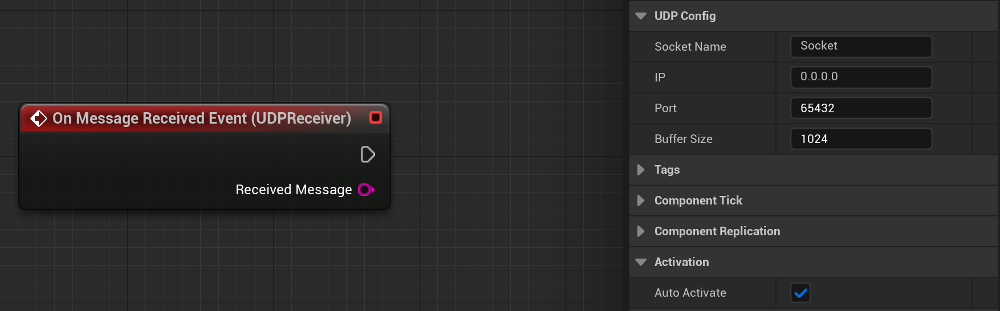
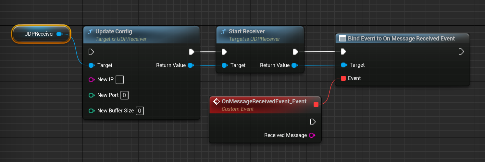

# UE UDP Receiver Plugin

Simple Unreal Engine (UE) plugin containing an actor component which creates a UDP receiver socket for inter-communication.

## Features
- Event-driven UDP message processing
- Blueprint integration
- Customizable IP, port, and buffer size

## Dependencies
Plugin makes use of `Networking` and `Sockets` UE modules.

## Usage
### Unreal Engine
1. Add the `UUDPReceiver` component to your actor
2. Configure the properties (IP, Port, etc.)
3. Set component `Auto activate` in Details pane, or call `StartUDPReceiver` in the Event Graph.




### Client Example (Python)
1. Import `socket` library dependency
```Python
import socket
```
2. Define socket IP address & port number
```Python
server_address = ('127.0.0.1', 65432)
```
3. Create connection to UDP socket
```Python
udp_socket = socket.socket(socket.AF_INET, socket.SOCK_DGRAM)
```
4. Send data
```Python
udp_socket.sendto('data', server_address)
```
5. Close socket connection
```Python
udp_socket.close()
```
